# Introduction to RL

We are not born with any knowledge we attain this knowledge by interacting with the world around us, when we interact with the world we learn about cause and effect and understand how the world responds to our actions. Once we understand how the world responds to our interaction we use this knowledge to attain specific goals. The real world is very complex so we create a learning environment with specific set of rules we make algorithms to tech agents in this world to learn from interactions and use this knowledge to obtain a certain goal.

---

# Application
The application of RL vary a lot ranging from 

The AI bot that plays Alpha GO

RL algorithm that plays Atari games

Teaching robots to walk 

and even self driving cars

---
# The Setting
In a RL environment there should be something that takes a particular decision this something is called and Agent. The Agent interacts with the environment and based on the feedback received by the environment make strategies to maximise its reward.

As an analogy we can consider our Agent to be a puppy who is new born and has only started to explore the environment. It knows that it has to follow what the owner says and when it does something right it gets a treat or a positive reinforcement or when it does something wrong it gets a negative reinforcement. It does not know how do something on its own when the owner says a command it does something randomly and the wait for the owner to give a feedback in the form or a reward based on the reward it acquires some knowledge and prepared itself for the next command.

After a lot of trial and error the puppy learns strategies to maximise the amount of treats it can get over the course of its lifetime there by understanding how to preform correctly to what its master is saying.

---

# Exploration-Exploitation Dilemma

## Exploration

Exploring potential hypothesis on how to perform an action.

## Exploitation

Exploring limited knowledge about what is already known to work well.

Consider a situation where our puppy learn to do 5 tricks now it is knows doing this tricks correctly will get it rewards but what if the owner gives an other command and the puppy try to do one of the five tricks this is called exploration-exploitation dilemma.

---

# The RL Framework: The Problem

# Introduction

This session is mostly to discuss about how we can take a real world problem and convert it into a specific method such that we can use reinforcement learning to solve them.

---

## The Setting

Earlier we have taken the example of a dog which learns through trail and error and waits for a reward and action from the owner. To change this to a reinforcement learning problem not much changes we can replace the dog with a robot or driverless car in general we call them a reinforcement learning agent.

To put this in RL Term we say that the Agent interacts with the Environment and that time involves in discrete time steps.

In the first time step the Agent waits for an Observation from the Environment then according the observation the agent must select an appropriate action in response. In the next time step the environment presents with a new observation and also gives a reward which indicates weather the agent has responded correctly or incorrectly.

This process continues for some time step where the environment sends a reward and observation and at each step the agent should present a action to the environment.

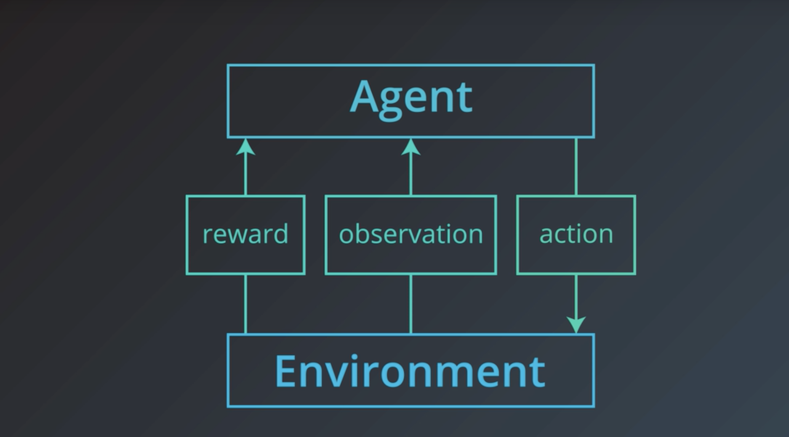

In RL terms we do not say that the agent receives an observation instead we refer to it as a state.

To represent this is a more mathematical way we can say that in the time-step 0 the environment septs state S0 to the agent the agent then responds with an action A0. In the next time step 1 the environment sends the agent with a state A1 and a Reward R1 then the agent sends back and action A1 to the environment.

This continues for the next state too

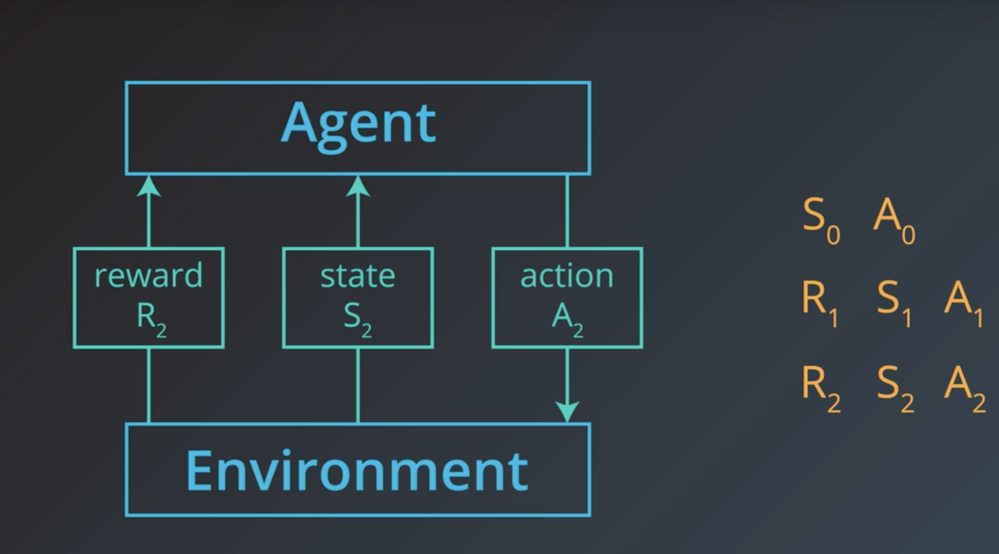

So generally we can say that when the agent interacts with the environment it manifest a series of state action and reward.

The Reward is the most relevant quantity to the Agent.

The goal of the Agent is to maximize expected cumulative reward.

 

---

# Episodic Tasks

The real world problems that we say have a well defined end point for example if we are considering playing a game when the agent looses or wins the task ends. If we consider a self driving car the task ends when the car crashes.

When we are considering such scenarios The agent learns by the reward in each of its life and the next live the agent has the added knowledge which allows it to perform better to achieve its goal.

---

# Continuous Tasks

Some tasks are not like this and does not have a well defined endpoint like an agent that buys and sells stocks such agents life without a lifetime and are called continuous tasks.

---

# The Reward Hypothesis

Earlier we discussed that the reward is like the number of treat that a puppy gets , the state is interaction with the owner and the action is the puppies response to the owners command. The task of the puppy here is to maximise the amount of treats that the puppy gets.

This is true for any reinforcement learning agents in general works this way the goal of the agent is to maximise the expected cumulative reward.

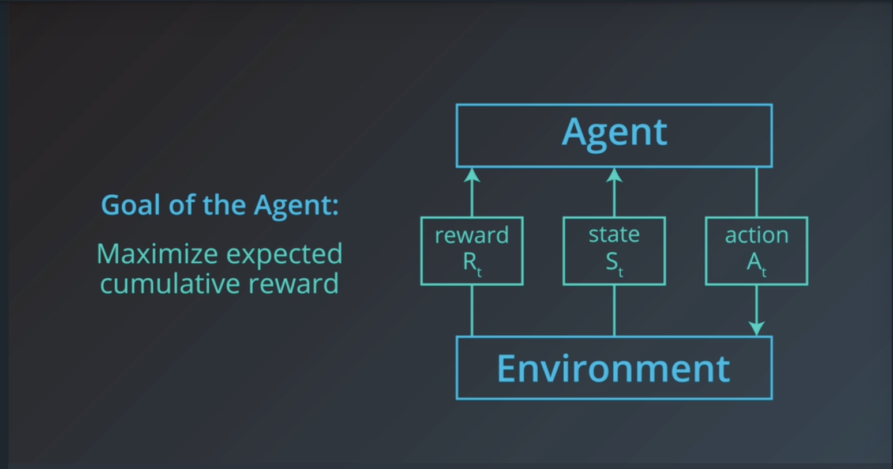

The reward hypothesis is that all goals can be framed as the maximisation of expected cumulative reward.

---

# Discounted Return

Lets us take a look at our puppy agent again, The goal of all agent is to maximise the cumulative reward but if we consider the lifetime of the puppy the puppy would be more interested in immediate reward compared to future reward this is where the concept of discount return comes in.

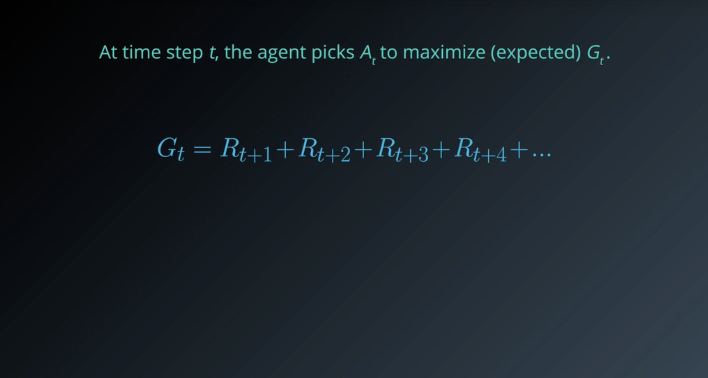

This is how we can represent the cumulative reward but here the future reward have same value as that of the present one so in-order to train the model efficiently we can introduce discounted returns

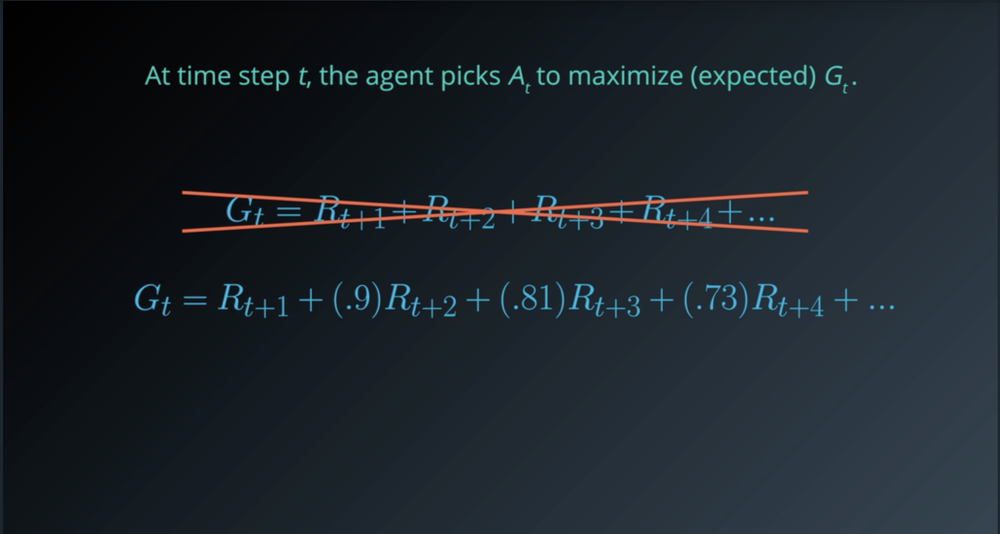

How we select this value is by using a discount rate represented by gamma, which would always be a value between 0 and 1.

then we multiply these values increasing by one in there power for each step.

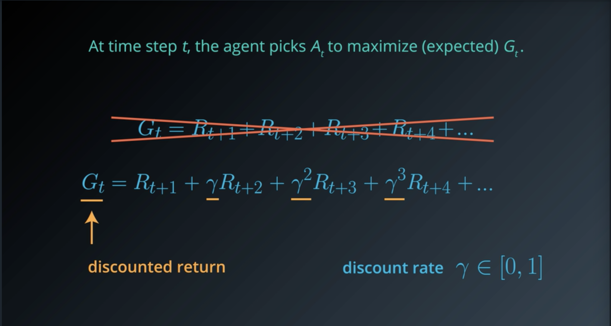

We can even use the value 0 or 1 to change the meaning of the whole return for example

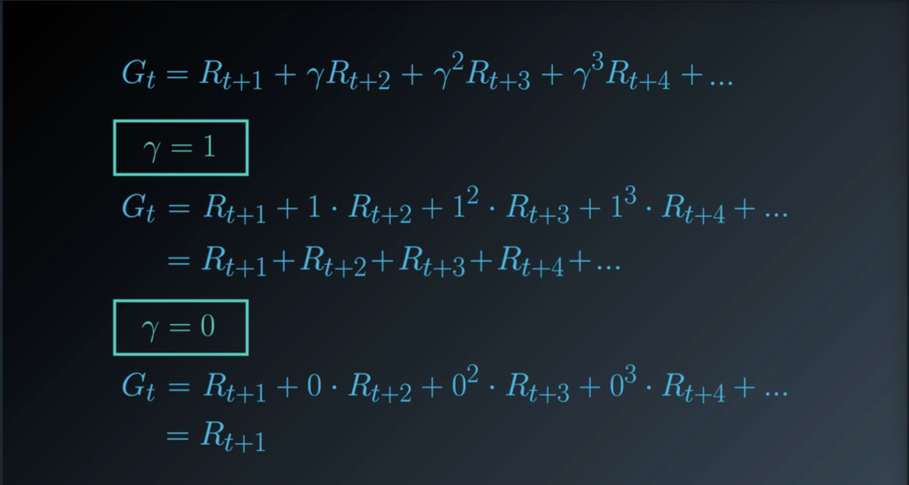

if gamma is 1 we would have the same return for each time-step and if we choose 0 the reward would only be applicable for the first time step.

---

# MDPs

Let us take the example of a robot that picks up garbage cans, this robot runs on battery and has a docking station. When the robot is not docked its purpose is to collect as much as cans as possible.

The robot has three actions

1. search
2. recharge 
3. wait

The robot can either search for garbage cans or be in the docking stand recharging else stay still and wait for someone to bring the can to the robot.

The robot also have two states 

1. High
2. Low

This corresponds to the amount of charge the robot has left on his battery , when it has high amount of charge left we can set it free to go and look for garbage cans but when the robot is in low state we should probably refrain from doing so reason being in this case the robot might end up turning off when in no charge and we having to go manually and pick up the garbage.

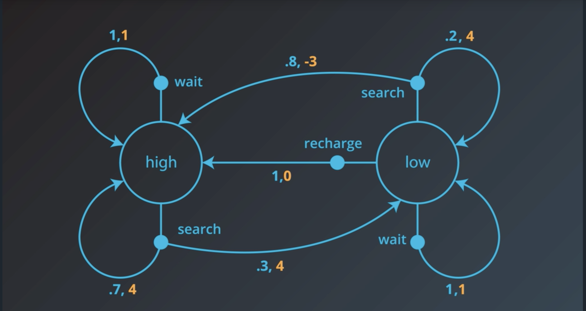

The picture below shows a state space diagram of the robot we are talking about earler,

Let us look at it individually 

when we are at high let say we are in the docking station and we have two actions that we can do that is 

1. Wait
2. Search

We are not considering recharge in this state since that does not make sense.

The next state is low that is lets say the robot is going on collecting cans in this state the robot can choose to do three action

1. Search
2. Wait
3. Recharge

Let us focus on High component for now,

We are assigning rewards for each decision that the robot takes if the robot is in high sate in the docking station and waits there and does not choose to move lets say the probability of doing this is 0.1 we give it a reward of 1 let say since someone brought a can to the robot. But lets say that the robot decides to search with a probability of 0.7 and collects 4 cans so we give it a reward of 4 assuming the robot still has high charge but if the robot goes to low charge that mean there is a probability of 0.3 that it goes to low charge but still manages to collect 4 cans we give it a reward of 4.

Now let us focus on the low state,

Assuming the robot is in low state and decides to wait and collects 1 can given that the probability of the robot waiting is 0.1 we give it a reward of 1, lets say the robot decided to search and collect some more can and the robot depletes its battery in this case we have to carry the robot to the docking station then lets say the probability of this happening is 0.8 and we give the robot a negative reward of -3. But instead if the robot goes on searching and still manages to be in low state and finds 4 cans we give it a reward of 4 given that the probability of this happening is 0.2.

There is one more scenario here if the current state is low and the agent decides to go to the docking station by itself with a probability of 1 (it does go there no matter what) the robot is not awarded any reward. 

This method of decision problems is called Markov decision problem and this is the underlying principle we use to design a RL problem. Some of the allocation of reward might seem a bit weird but we would get deeper into this.

To summarise

We can say that 

A finite Markov decision problem is defined by:

- a (finite) set of states S
- a (finite) set of actions A
- a (finite) set of rewards R
- the one step dynamic of the environment
- a discount rate

Things like the state action and discount rate is known to the agent but the one step dynamics and rewards in unknown.

---

# The RL Framework : The Solution

# Policies

We know that we use a MDP to make the framework for a RL problem. If we look at examples of training a humanoid robot how to walk we would notice that how the robot has to behave depends on lot of factors like the change in environment for example walking in a hilly terrain is different to walking in a normal terrain this is where the concept of policies come in.

There are two kinds of policies

1. Deterministic
2. Stochastic

 

## Deterministic Policy

Deterministic policy can be defined as the mapping of a state to the action basically we can think of it as a factory that takes in the state and outputs the action.

## Stochastic Policy

Stochastic policy is the mapping of the state and action to the probability of the agent taking the said action. We can think of it as a factory given an action and a state outputting the probability that the agent takes the action in the given state.

Let us see this on the concept of our waste collecting robot example.

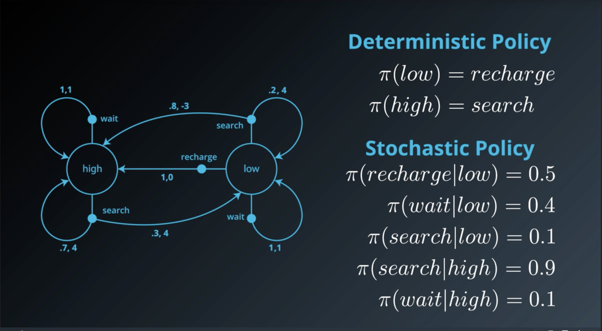

---

# Gridworld Example

Let us consider a very small world which are grids of green grassy patches of which two of these grids have mountains on them. 

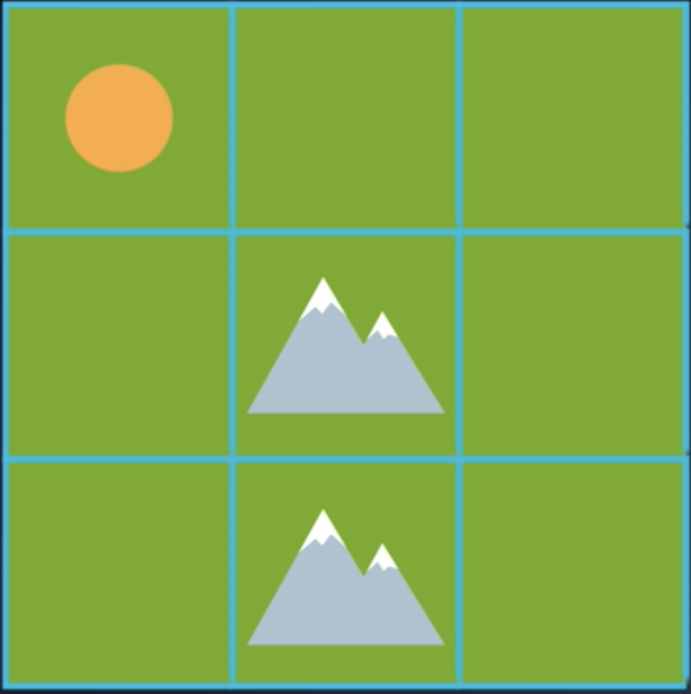

The locations in this world can be considered as states in the environment.

Let us say that the agent in any given time-step can move up,down,left or right and can only do actions which will not let it fall off the grid. We can represent this using arrows.

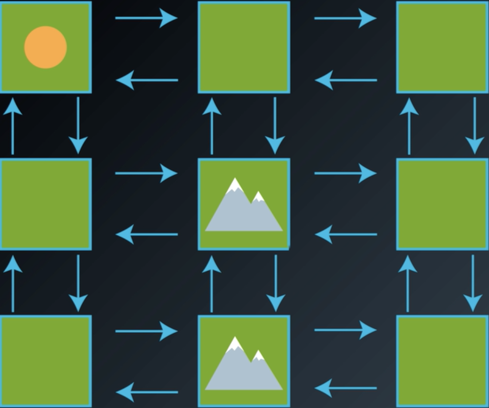

Let us say that the goal of the agent is to reach the bottom right corner and this task can be considered as an episodic task and when the agent reaches the goal an episode ends. Here we can leave out the possibility of the agent going out of the right bottom corner as the task ends there.

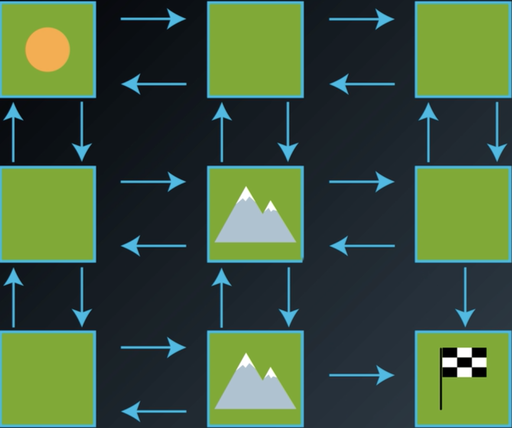

Now we need to assign rewards to actions the agent takes

if the agent moves to a grassland let us give it a reward of -1

If it moves to a mountain area let us give it a reward of  -3 

If the agent reaches the goal let us give it a reward of 5.

This reward structure encourages the agent to reach the goal as soon as possible since for every step it takes outside the goal it is receiving some kind of penalty.

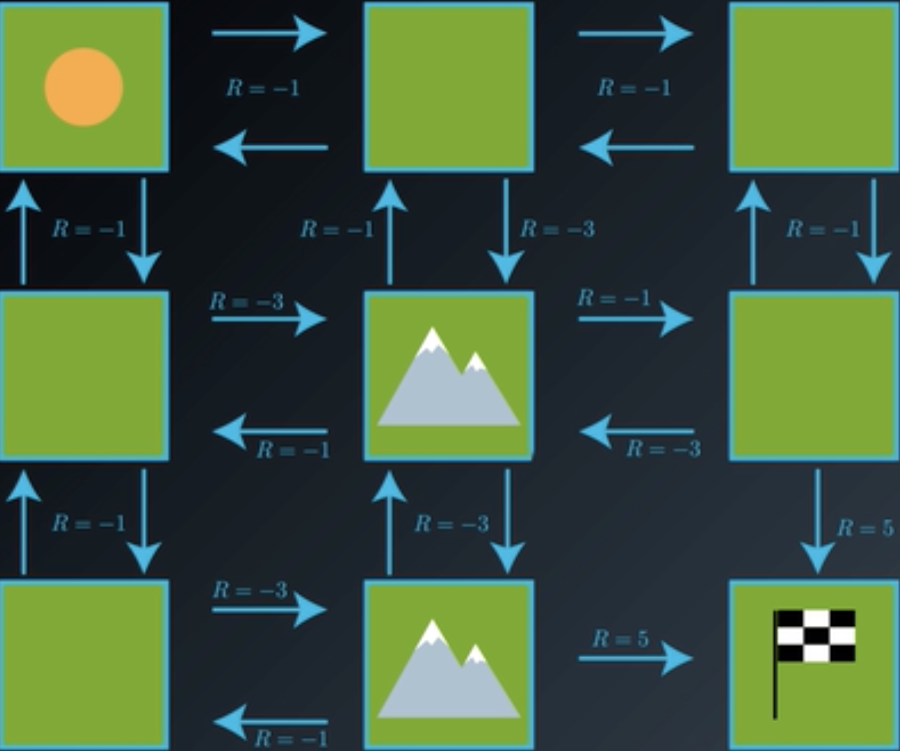

When the agent reaches the goal it gets a reward of 5 and the episode ends.

---

# State-Value function

Let us say before we start our learning we follow a very bad model to reach our goal we start from the top left corner and then we move through all the states and reach the last grid.

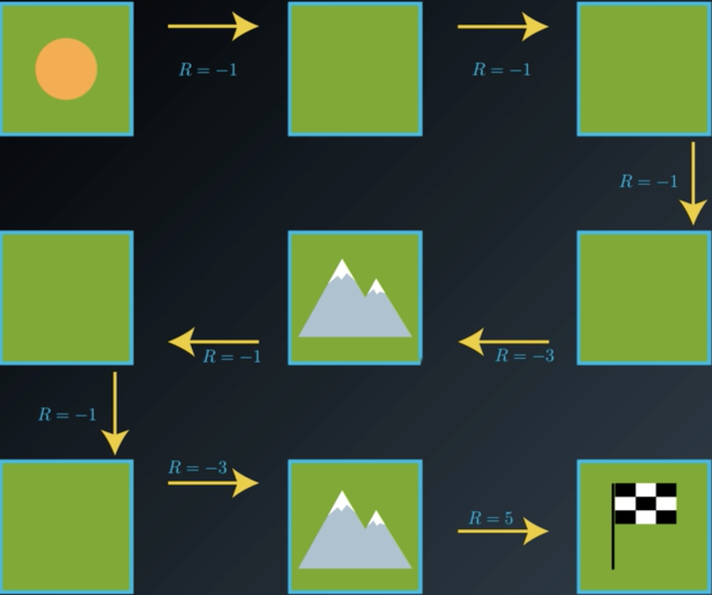

Now the we need to calculate the cumulative reward when we reach the final stage , we are not using the concept of discounted rate here or lets say we are using discount rate of 1, now the cumilative reward is -6.

We can assign this number to the grid on top left corner.

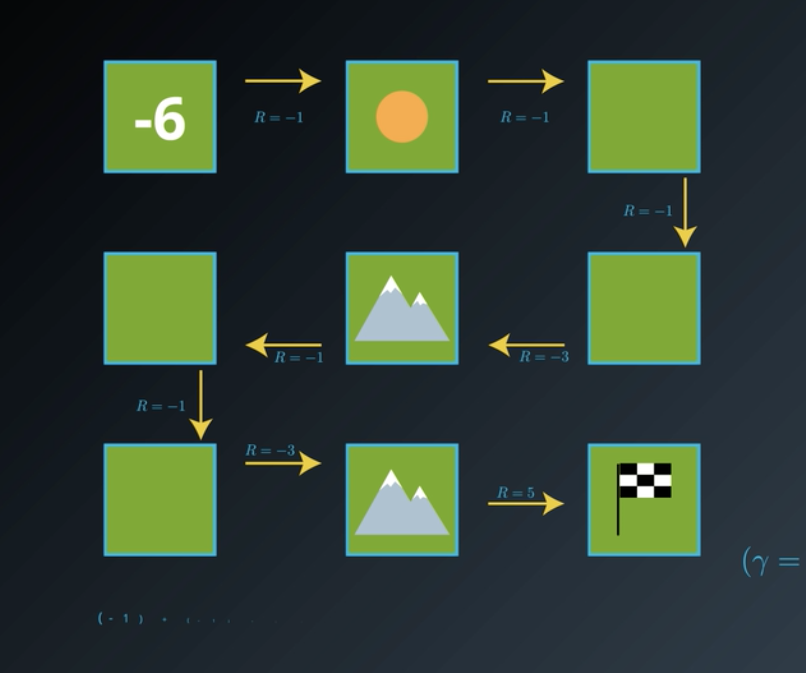

Now let us start from the next adjacent grid and do the same and continue for all the grids, since this is an episodic tasks the task will stop when we reach the last grid or if we start from the last grid also the episode stops and we can just associate this with a reward of 0.

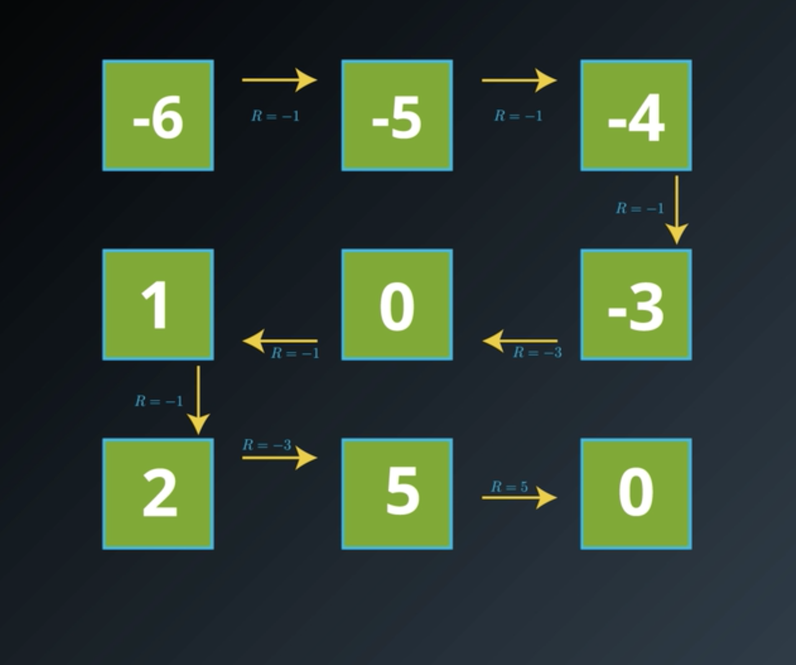

Hence the grid formed from this method is corresponds a number to the action the agent takes if it starts on that state.

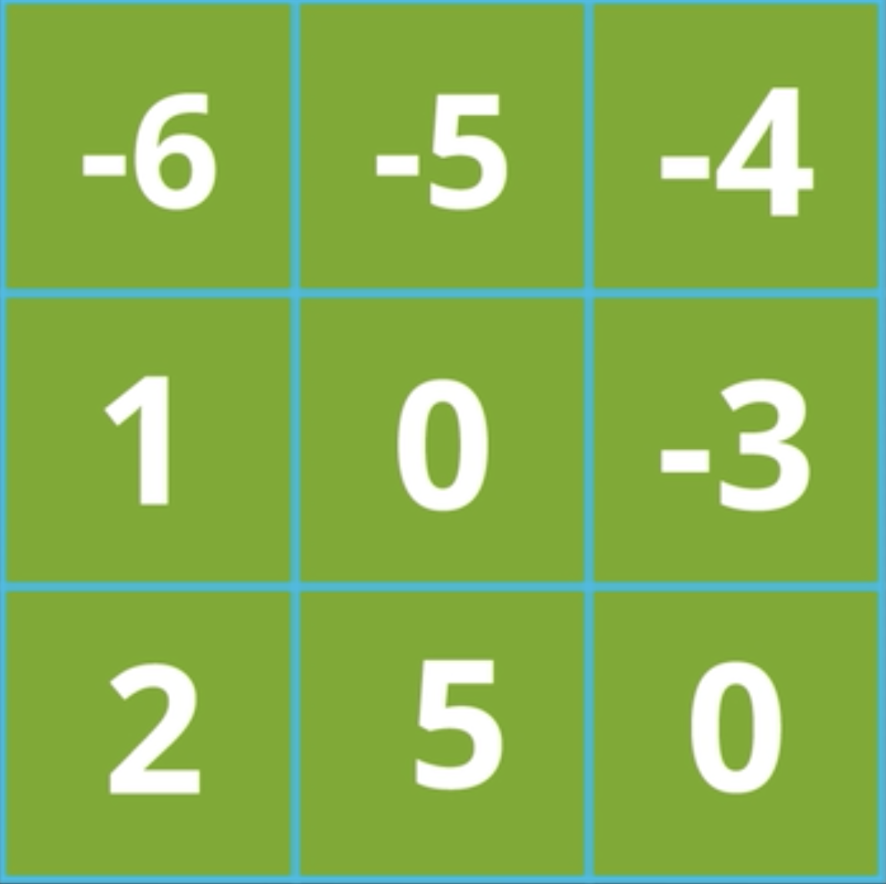

We refer to this function as a state value function.

We call the sate-value function for policy pie The value of state s under a policy pie,

For each of the state s it yields the expected return if the agent starts in state s and then uses a policy pie to choose its action for all time-steps.

---
