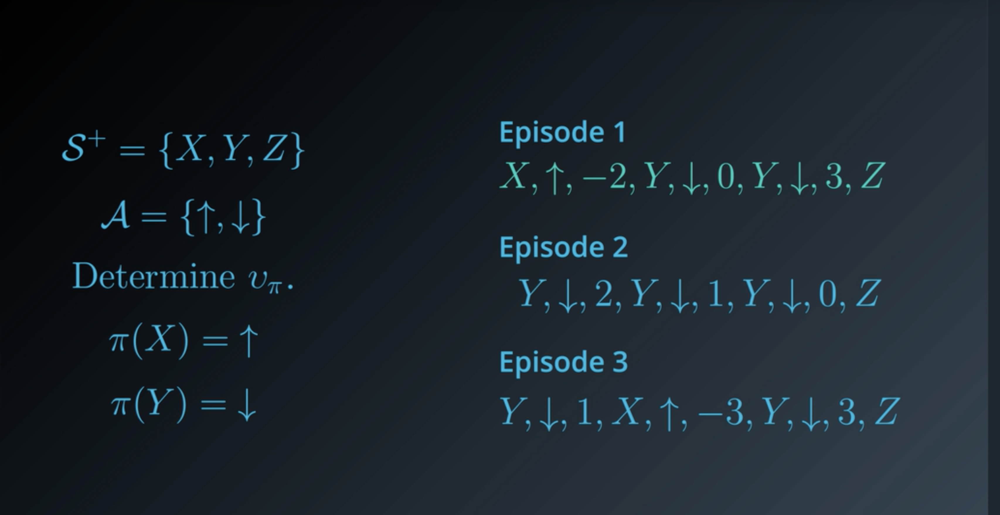
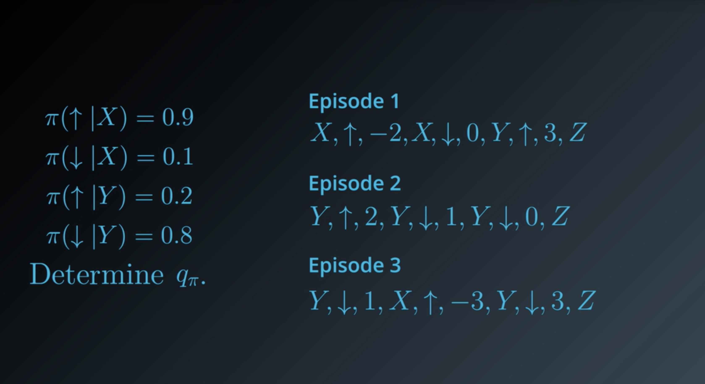
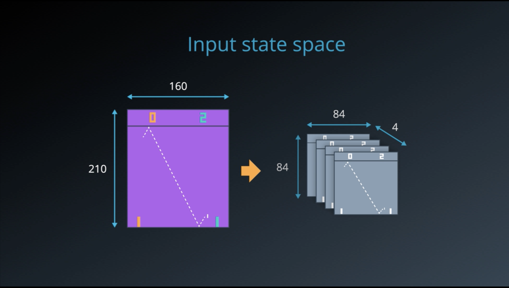
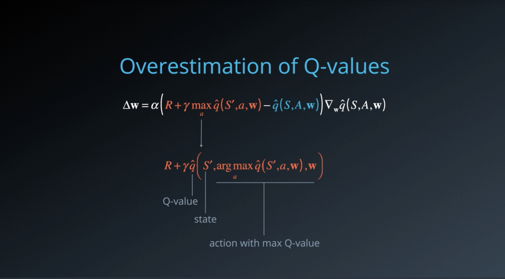
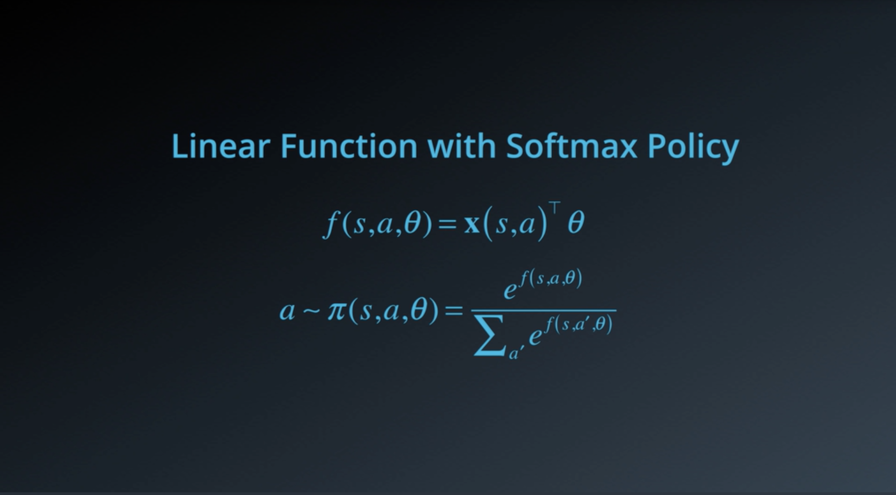

# Introduction to RL

We are not born with any knowledge we attain this knowledge by interacting with the world around us, when we interact with the world we learn about cause and effect and understand how the world responds to our actions. Once we understand how the world responds to our interaction we use this knowledge to attain specific goals. The real world is very complex so we create a learning environment with specific set of rules we make algorithms to tech agents in this world to learn from interactions and use this knowledge to obtain a certain goal.

---

# Application
The application of RL vary a lot ranging from 

The AI bot that plays Alpha GO

RL algorithm that plays Atari games

Teaching robots to walk 

and even self driving cars

---
# The Setting
In a RL environment there should be something that takes a particular decision this something is called and Agent. The Agent interacts with the environment and based on the feedback received by the environment make strategies to maximise its reward.

As an analogy we can consider our Agent to be a puppy who is new born and has only started to explore the environment. It knows that it has to follow what the owner says and when it does something right it gets a treat or a positive reinforcement or when it does something wrong it gets a negative reinforcement. It does not know how do something on its own when the owner says a command it does something randomly and the wait for the owner to give a feedback in the form or a reward based on the reward it acquires some knowledge and prepared itself for the next command.

After a lot of trial and error the puppy learns strategies to maximise the amount of treats it can get over the course of its lifetime there by understanding how to preform correctly to what its master is saying.

---

# Exploration-Exploitation Dilemma

## Exploration

Exploring potential hypothesis on how to perform an action.

## Exploitation

Exploring limited knowledge about what is already known to work well.

Consider a situation where our puppy learn to do 5 tricks now it is knows doing this tricks correctly will get it rewards but what if the owner gives an other command and the puppy try to do one of the five tricks this is called exploration-exploitation dilemma.

---

# The RL Framework: The Problem

# Introduction

This session is mostly to discuss about how we can take a real world problem and convert it into a specific method such that we can use reinforcement learning to solve them.

---

## The Setting

Earlier we have taken the example of a dog which learns through trail and error and waits for a reward and action from the owner. To change this to a reinforcement learning problem not much changes we can replace the dog with a robot or driverless car in general we call them a reinforcement learning agent.

To put this in RL Term we say that the Agent interacts with the Environment and that time involves in discrete time steps.

In the first time step the Agent waits for an Observation from the Environment then according the observation the agent must select an appropriate action in response. In the next time step the environment presents with a new observation and also gives a reward which indicates weather the agent has responded correctly or incorrectly.

This process continues for some time step where the environment sends a reward and observation and at each step the agent should present a action to the environment.

In RL terms we do not say that the agent receives an observation instead we refer to it as a state.

To represent this is a more mathematical way we can say that in the time-step 0 the environment septs state S0 to the agent the agent then responds with an action A0. In the next time step 1 the environment sends the agent with a state A1 and a Reward R1 then the agent sends back and action A1 to the environment.

This continues for the next state too

So generally we can say that when the agent interacts with the environment it manifest a series of state action and reward.

The Reward is the most relevant quantity to the Agent.

The goal of the Agent is to maximize expected cumulative reward.

 

---

# Episodic Tasks

The real world problems that we say have a well defined end point for example if we are considering playing a game when the agent looses or wins the task ends. If we consider a self driving car the task ends when the car crashes.

When we are considering such scenarios The agent learns by the reward in each of its life and the next live the agent has the added knowledge which allows it to perform better to achieve its goal.

---

# Continuous Tasks

Some tasks are not like this and does not have a well defined endpoint like an agent that buys and sells stocks such agents life without a lifetime and are called continuous tasks.

---

# The Reward Hypothesis

Earlier we discussed that the reward is like the number of treat that a puppy gets , the state is interaction with the owner and the action is the puppies response to the owners command. The task of the puppy here is to maximise the amount of treats that the puppy gets.

This is true for any reinforcement learning agents in general works this way the goal of the agent is to maximise the expected cumulative reward.

The reward hypothesis is that all goals can be framed as the maximisation of expected cumulative reward.

---

# Discounted Return

Lets us take a look at our puppy agent again, The goal of all agent is to maximise the cumulative reward but if we consider the lifetime of the puppy the puppy would be more interested in immediate reward compared to future reward this is where the concept of discount return comes in.

This is how we can represent the cumulative reward but here the future reward have same value as that of the present one so in-order to train the model efficiently we can introduce discounted returns

How we select this value is by using a discount rate represented by gamma, which would always be a value between 0 and 1.

then we multiply these values increasing by one in there power for each step.

We can even use the value 0 or 1 to change the meaning of the whole return for example

if gamma is 1 we would have the same return for each time-step and if we choose 0 the reward would only be applicable for the first time step.

---

# MDPs

Let us take the example of a robot that picks up garbage cans, this robot runs on battery and has a docking station. When the robot is not docked its purpose is to collect as much as cans as possible.

The robot has three actions

1. search
2. recharge 
3. wait

The robot can either search for garbage cans or be in the docking stand recharging else stay still and wait for someone to bring the can to the robot.

The robot also have two states 

1. High
2. Low

This corresponds to the amount of charge the robot has left on his battery , when it has high amount of charge left we can set it free to go and look for garbage cans but when the robot is in low state we should probably refrain from doing so reason being in this case the robot might end up turning off when in no charge and we having to go manually and pick up the garbage.

The picture below shows a state space diagram of the robot we are talking about earler,

Let us look at it individually 

when we are at high let say we are in the docking station and we have two actions that we can do that is 

1. Wait
2. Search

We are not considering recharge in this state since that does not make sense.

The next state is low that is lets say the robot is going on collecting cans in this state the robot can choose to do three action

1. Search
2. Wait
3. Recharge

Let us focus on High component for now,

We are assigning rewards for each decision that the robot takes if the robot is in high sate in the docking station and waits there and does not choose to move lets say the probability of doing this is 0.1 we give it a reward of 1 let say since someone brought a can to the robot. But lets say that the robot decides to search with a probability of 0.7 and collects 4 cans so we give it a reward of 4 assuming the robot still has high charge but if the robot goes to low charge that mean there is a probability of 0.3 that it goes to low charge but still manages to collect 4 cans we give it a reward of 4.

Now let us focus on the low state,

Assuming the robot is in low state and decides to wait and collects 1 can given that the probability of the robot waiting is 0.1 we give it a reward of 1, lets say the robot decided to search and collect some more can and the robot depletes its battery in this case we have to carry the robot to the docking station then lets say the probability of this happening is 0.8 and we give the robot a negative reward of -3. But instead if the robot goes on searching and still manages to be in low state and finds 4 cans we give it a reward of 4 given that the probability of this happening is 0.2.

There is one more scenario here if the current state is low and the agent decides to go to the docking station by itself with a probability of 1 (it does go there no matter what) the robot is not awarded any reward. 

This method of decision problems is called Markov decision problem and this is the underlying principle we use to design a RL problem. Some of the allocation of reward might seem a bit weird but we would get deeper into this.

To summarise

We can say that 

A finite Markov decision problem is defined by:

- a (finite) set of states S
- a (finite) set of actions A
- a (finite) set of rewards R
- the one step dynamic of the environment
- a discount rate

Things like the state action and discount rate is known to the agent but the one step dynamics and rewards in unknown.

---

# The RL Framework : The Solution

# Policies

We know that we use a MDP to make the framework for a RL problem. If we look at examples of training a humanoid robot how to walk we would notice that how the robot has to behave depends on lot of factors like the change in environment for example walking in a hilly terrain is different to walking in a normal terrain this is where the concept of policies come in.

There are two kinds of policies

1. Deterministic
2. Stochastic

 

## Deterministic Policy

Deterministic policy can be defined as the mapping of a state to the action basically we can think of it as a factory that takes in the state and outputs the action.

## Stochastic Policy

Stochastic policy is the mapping of the state and action to the probability of the agent taking the said action. We can think of it as a factory given an action and a state outputting the probability that the agent takes the action in the given state.

Let us see this on the concept of our waste collecting robot example.

---

# Gridworld Example

Let us consider a very small world which are grids of green grassy patches of which two of these grids have mountains on them. 

The locations in this world can be considered as states in the environment.

Let us say that the agent in any given time-step can move up,down,left or right and can only do actions which will not let it fall off the grid. We can represent this using arrows.

Let us say that the goal of the agent is to reach the bottom right corner and this task can be considered as an episodic task and when the agent reaches the goal an episode ends. Here we can leave out the possibility of the agent going out of the right bottom corner as the task ends there.

Now we need to assign rewards to actions the agent takes

if the agent moves to a grassland let us give it a reward of -1

If it moves to a mountain area let us give it a reward of  -3 

If the agent reaches the goal let us give it a reward of 5.

This reward structure encourages the agent to reach the goal as soon as possible since for every step it takes outside the goal it is receiving some kind of penalty.

When the agent reaches the goal it gets a reward of 5 and the episode ends.

---

# State-Value function

Let us say before we start our learning we follow a very bad model to reach our goal we start from the top left corner and then we move through all the states and reach the last grid.

Now the we need to calculate the cumulative reward when we reach the final stage , we are not using the concept of discounted rate here or lets say we are using discount rate of 1, now the cumilative reward is -6.

We can assign this number to the grid on top left corner.

Now let us start from the next adjacent grid and do the same and continue for all the grids, since this is an episodic tasks the task will stop when we reach the last grid or if we start from the last grid also the episode stops and we can just associate this with a reward of 0.

Hence the grid formed from this method is corresponds a number to the action the agent takes if it starts on that state.

We refer to this function as a state value function.

We call the sate-value function for policy pie The value of state s under a policy pie,

For each of the state s it yields the expected return if the agent starts in state s and then uses a policy pie to choose its action for all time-steps.

---

# Bellman Equation

As we said above calculating the reward one by one would be very hard, bu what we can do is if we know the reward of a particular sate it is easy for us to calculate the discount of the nearby states.

If we look closely the value function has a nice recursive property,

Let us erase some of the values then we would be left with something like this,

here since we are using a discount rate of 1 to find the value of the intermediate grid we can just sum with the reward consider 2 if you add -1 we will get 1 which is the value for the adjacent grid we can continue this for all the grid.

This applies to our simple world but how can we express this for a more complex world ?

We use the bellman expectation equation.

---
# Optimally

Let us compare two state value policies, we can see a pattern here the one on the left is the values are less that that of on the right or the once on the right are greater than or equal to the once on the left, this means the the one on the right offers a better reward function than the one on the left.

Similarly the goal of the agent would be to find the optimal policy in this, by definition we can say

This defines optimality and the goal of the agent is to find the optimal solution to the MVP that is defined.

The optimal policy function is denoted by 

$V*$

---
# Action Value Functions

basically here also we are calculating a grid but instead of using denoting by one value we use 4 values to represent what happens when each action is taken by the agent this would look something like,

---

# Optimal Policy

The goal is basically for the agent to construct an action value function by interacting with the environment and uses

This is what we have right now.

All we have to do to find the optimal value is to follow the grid in each step for the higher value this would give us the optimal policy.

This is what that would look like , in the grid where it is 1 for all values we can actually follow any path and would yield the optimal result.

---
# Dynamic Programming

This is a problem which is more simple than the RL problem here the agent has full knowledge about the environment.

Let us consider a more simpler example

with just 4 grids and one mountain and by applying similar reward funcitons

As discussed earlier we need to define the action value function for each of the state in the world

If we consider the first grid let us name it s1 in this grid we can either move left or right and the probability of moving right is 0.5 and so is the probability of moving left. Let us use the same concept for all the states.

To find the bellman equation from this what we can do is to multiply the probability of each state to the reward for the taken action and the reward at that stage

Once we have the reward for all these states we can just use the system of equations to find the values for each states.

This is a bit cumbersome method but there is an iterative method which we can follow that is initially we can guess the value for every stage and move from one stage to another and then update the values and eventually we would converge to the result.

What this basically means is converting the equations we have earlier to an update rule.

## [Solving Open AI Frozen Lake using Dynamic Programming](https://github.com/abhijitramesh/RL-under-the-hood/blob/master/frozenlake/Dynamic_Programming.ipynb)

---

# Monte Carlo Method

# Introduction

Previously we solved the frozen-lake environment problem from OpenAI using Dynamic Programming Now we will focus on doing something better that is for dynamic programming we assume that the agent knows everything about the environment and it takes decision now we are going to follow a different approach where the agent is not given any knowledge of the environment and since this is one of the underlying principle of reinforcement learning we are going to use this for the future methods also.

---

# MC Prediction : State Values

Lets say that the we have a very small frozen lake environment with x y and z, the goal of the agent is to reach z and thereby ending the episode. When the agent is at x or y it receives a reward and a state and chooses the next action. Similarly let us assume that the agent did the same for 3 episodes following three policies.

What monte carlo method tells us is to take observe one state determine the cumulative reward of that state then average the value to find the approximation for the value of that state.

Here we are following the state X

Let us follow the sate Y but here there are multiple occurrence of the sate in each step so we need to follow only one of them and for that we consider that each visit as an entry to the sate and we need to determine if we want to follow first entry or second entry Monte Carlo method.

Here we are considering the first visit MC method.

Another approach would be to consider all the visits to all the instances of the state Y

---

# MC Prediction : Action Value

In the dynamic programming example we converted the state value to action value similarly here also we need to obtain the action value so we have to do a bit of modificaiton insted of selecting the state we select the state action pair

But here the problem is since we are selecting the pair from the states that the agent has visited pairs such as X and down and Y and up cannot be determined so the solution to this is we only deal with stochastic policy and not deterministic policy.

Here the agent eventually visits all the states given enough number of episodes.

---

# MC Control : Incremental means

We will be following generalized policy evaluation here, if we follow the current evaluation policy we will need at-least 5k episodes to do an update but instead if we keep track on a running average and also update in each episode we would get a much better , to make a computationally easy algorithm we need to apply some math. 

This is the basic idea now we need to implement this in MC method.

# [Solving BlackJack using Monte Carlo Method](https://github.com/abhijitramesh/RL-under-the-hood/tree/master/blackjack)

# Temporal Difference Method

# Introduction
Imagine a humanoid robot for this robot to mimic things exactly like human beings we cannot consider the task to be episodic, Consider the example of monte carol method if it has to learning anything it needs the episode to end converting this to self driving car terms every time the algorithm needs to learn something the car needs to crash this is not acceptable and is very expensive hence we need to follow a better approach this is where temporal difference methods comes to play the agent can be learning every day and all day just like how we are interacting with the streams of data over the internet. Temporal Difference methodcan be applied to solve episodic as well as continues task.

In the heart of all the state of the art models that we read and see about in the internet lies this method.

---
# TD Prediction : TD(0)

In the MC approach we take a look at a state actin pair and if it is our first visit we update the sate, but a thing to note here is that the policy does not change between episodes.

Here is we are instead keeping track of the state values we use a different equation

Here we can use the bellman equation to do some modification to the update statement we can plug in the equation to obtain

What this mean is here the update statement is not only aware of the current state but it is also taking into consideration the discounted value of a upcoming state.

Why are we doing this mainly this removed any kinds of mention of the ending of the episodic task and moreover we can update the value in each time-step.

So now before taking any action the agent only depends on the current value state but when the update is done we consider the possibility of value of new state and reward.

We refer to this as TD target

Basically what this equation does is find a middle ground between the previous estimate and the next estimate and we can set the value of alpha according to which estimate we trust  more.

Here we can visualize this concepts, the update statement has been updated so when the value of alpha is set to one we trust the next state and when in is it to zero we trust the pervious state also we do not ever do and ideally we set the value close to zero so that the agent learns something.

The algorithm that we implement to do the same is called one-step TD or TD(0)

---

# TD Prediction : Action Values
In order to convert the TD prediction to Action Values all we have to do in the update statement is to move form every state to ever state action pairs.

And also instead of waiting for each state we move to each state action pair to do the update.

And if the agent interacts with the environment long enough the agent would have a pretty good understanding of how the environment works.

---

# TD Control : Sarsa(0)
To do the control what we do here is to use an epsilon greedy algorithm. We start with selecting an epsilon as 1 and then selecting the 0 or 1 in equal probability after we update the state action pair and construct a policy to update the epsilon greedy policy the algorithm is called sarsa(0).

# TD Control : Sarsamax or Q-Learning

Basically what we are doing here is changing the epsilon greedy method with a greedy method by choosing the reward which maximizes the state and action pair value for the next state.

---

What expected Sarsa does is that the agent selects the probability that the agent selects an action and returns the respective action value pair.

---

# [Solving Clif Walking using Temporal Method](https://github.com/abhijitramesh/RL-under-the-hood/tree/master/clifwalking)
---

# Deep Reinforcement Learning

# Introduction

Deep reinforcement using deep learning uses multi layered neural networks to do reinforcement learning.

Reinforcement learning is classified into two 

1. Model Based Approaches
    1. Policy Iteration
    2. Value Iteration
2. Model Free Approaches
    1. Monte Carlo Method
    2. Temporal Difference Learning

In a nut shell RL problem that are discussed above are consist of limited state and action spaces but most real world problems are very large and consist of continuous real value numbers.

This is where Deep Reinforcement Learning comes in with Deep Q Learning and algorithms that directly optimize the policy like policy gradient. There there are approaches which combine the best of both worlds Actor-Critic Method.

---

# Discrete VS Continuous Spaces

The cases what we have learned are used to deal with discrete cases for example in approaches such as policy iteration we have a loop that iterates over all the states abd

and even in model free approaches we consider such stuff for example

Basically what continuous means is something that contradicts discrete

How does this mean in RL terms well uptill now we considered everything to be a grid worls where the agent moves from one grid to another but then if we consider real would there are no grid a robot may have to move from so and so distance away from the wall while avoiding obsructions.

This is an example of continuous space but lets  say that we are teaching a robot to throw a dart in this case the robot has to select various factors such as the amount of force and the angle etc.. from a continuous space to execute so that it can learn how to do the task optimally.

The strategy that we use to do such stuff are mainly discretization and function approximation.

---

# Discretization

Converting a continuous space into discrete space is called discretization,

Let us consider the vacuum cleaner robot from the above example we draw a virtual grid to the continuous space, we don't tell the robot to be exactly in the center of this position since that is not ideal and weather the robot is in (3.1,2.5) or (3.6,2.1) we can round this off to (3,2), yes this might cause some kind of errors in some environments but we should be fine for most part.

Actions can also be discretized for example we can round off 90.4 to 90 degree and so on.

Let us say that there are objects in this world, in this grid worlds we mark off these spaces and call them occupancy grids. 

Two solution to this is 

Vary the grid at spaces where its required

Alternate approach would be to divide the grid into smaller grids where required

Why do we divide the grid at only the necessary spaces because if we do for the whole space we will end up increasing the state spaces.

Now we might think how to apply this knowledge to something other than a grid world lets take the example for automatic transmission cars

The reward here is inversely promotional to the fuel consumption and the speed can be discretized into ranges, the fact is there is a single gear is the most optimal in each range these ranges can non uniform and if there are more factors to this like throttle position they can be sub divided as well.

---

# [Notebook for implementation of Discretization in  Q-learning on MountainCar environment](https://github.com/abhijitramesh/RL-under-the-hood/blob/master/Discretization.ipynb)

---

# Tile Coding

If we already know the state space we can use a more generic method to split the environment as grid one of this method is called tile coding

Basically what this means is we can overlay grids on top of each other by offsetting it a bit so that any point on this can be identified by the tiles that it activates.

 

If we assign a bit for the tiles we can represent the state space as a bit vector with 1s for the tiles that get activated and 0s else where

In the tile coding algorithm instead of representing as a separate state  we represent it as binary vectors and also associate a weight and the tile coding algorithm update these weights iteratively this ensures that the nearby values that share tiles also share some component of state value smoothing the learning value function.

The drawbacks of tile coding is that we should select the number of tiles offset and similar characteristics.

---

# Adaptive Tile Coding

This is a better method for tile coding basically what this means is we start with a bigger tile and split it into two whenever required. We split when we know that our value function is not changing or basically when our model is no longer learning.

we can stop splitting when we reach a upper bound of splits.

In order to find which tile to split we need to find which one is more likely to have greatest effect in the value. In-order to do this we keep track of projected weights to the corresponding to the tile.

Adaptive coding lets us eliminate the use of manually setting offsets number of tiles etc...

---

# [Tile Coding on Acrobot](https://github.com/abhijitramesh/RL-under-the-hood)

---

# Course Coding

Course uses circles instead of grids and a state on it would activate the circles that are coinciding here this can also be translated to binary vectors with one for those circles and zero for the rest. This is done in a 2d space but we can extend this to a higher dimension where circles become sphere and hyper spheres.

Using small circles gives us less generalization but a higher resolution where as using a bigger circles give us better generalization resulting in a smooth value function but we might loose some resolution.

 

## Radial Basis Function

Coarse coding is similar to tile coding where we form vectors with 1 for spaces which are active and 0 for non active an extension of this idea is to use the distance from center of that circle to see how active that feature is these measures can be used by a gaussian or bell shaped curve centered on the circle which is known as a radial basis function. This is also a continuous feature but we can make them smaller compared to continuous state spaces.

---

# Function Approximation

The limitation to discretization is that if the underlying continuous space is too large we might end up making the discretization also so large that we loose its advantage more over in continuous spaces the function value is very smooth while transaction from one state to other but in discretization this is not how it happens.

What we are after is the state functon or value funciton ideally capturing this is practically in-feaseble and hence we try out best to apporximate this. we represent this by using a state w in the function which shows a vector which shapes the function.

Some ways to do it are mapping a state to its value, mapping a state and action to its q value or even mapping a state to a set of q vauels.

Let us see how we do the apporximation of state to value,

First we need a vector representing the state this is the feature vector and also we have another vector for our parameters inorder to get the scalar value all we have to do is a dot product.

---

# Linear function approximation

Let us say we have formed the value of the weights w randomly and have computed the value of the state v-hat(s,w)

How do we converge to the correct value of w, well since this is an optimization problem we can use gradient descent.

How this works basically is the value of alpha is our learning rate and in each step we step the value with the rate of that error away from the error.

We can also do the same for action value also we just need to take the feature matrix as the action and states.

And if we are mapping a state to actions what we can do is change our weight vector to weight matrix this help us to output different action value pairs

The only limitation to linear function approximation is as the name suggest this can be applied to linear functions and if we are solving a non linear problem this would give a bad result.

---

# Non-Linear function approximation

We can apply the same solution as we do to linear function approximation but the catch here is we pass the dot product to a non-linear function, yes this is the activation function which is exactly the basis of artificial neural networks.

Here also we can use gradient descent to update the value of the weights.

---
# Deep Q Learning

# Neural networks as Value Function

Neural networks are thought of as universal function approximations,

What we do in reinforcement learning is device a policy which maps a state to a real number we can do the same using a neural network all we have to do in input the states as a feature vector pass it through a neural network to get the value which can be represented as v pi of s,w where w is the weights of the neural network.

How do we learn these weights ? well gradient decent.

If we know the final value we can use this to calculate the loss and then use gradient descent to update our weights through back-propagation.

Now the question is how do we find out the loss ? this is where we apply our knowledge of Reinforcement Learning.

This is where reinforcement learning differs from supervised learning.

---

## Monte-Carlo Method

We can plug in the monte carol return which is the cumulative reward discounted to the update statement of gradient descent.

We can do the same for action value pair also.

### The algorithm to do monte carol with function approximation

---

## Temporal-Difference method

Here instead of using the actual return we use an estimated return

### The algorithm to do SARSA with function approximation

This has some drawbacks the policy being learned and the one being followed are almost the same.

If we want to learn a more exploratory policy we need off-policy algorithms.

---

# Deep Q learning

we use the same algorithm as  SARSA but the difference is in the update step, instead of choosing the next action from the same policy we choose an action greedily which would maximize the expected value going forward we do not take this action it is only used for performing the update.

hence we are using different policies.

To change this to a continuous task we can either treat episodes as a very long task or remove the concept of episodes as a whole.

The catch is we need to set some kind of control to see if our algorithm is learning properly or if its failing.

### Advantages of Off-policy learning

- More exploration while learning
- learning from demonstation
- supports offline/batch learning

---

# Deep - Q network

In 2015 deep mind made a break through when they developed a network which played video games better than human beings without being given any access to the underlying environment and only the pixel values which a human player might also see.

How this works is by the neural network which acts as a function approximate is given the input image as the states in the screen the network sees the screen and outputs a set of action values the maximum of which is the action to be taken. For back-propagation the network is given the scores as reward.

Let us see how complex the state space is the the space is 210 length and 160 wide and each pixel can have 256 possible values to make this a bit more easy to handle deep mind transformed the image to grey scale and then made them squares of 84 by 84 and in-order to make the network learn sequential data they stacked 4 layers on top of each other making it 84x84x4.

To neural network is made to produce a set of actions once the set is produced we can select the required action either scholastically or by taking the maximum value of the actions produced.

This is the neural network uses by deep-mind there are convolutional layers which allows the model to learn about the spatial elements this is then passed to a series of convolution as well as relu activation function then there comes a fully connected layers which again has relu activation functions and finally mapped to an action space.

The same network was used for all the Atari-games Deep mind tested it on but each time the network was trained from scratch.

---

# Experienced Replay

This is basically like collecting a set of data by practicing out with the interaction to the environment and then later learning  mapping from these practices on what action to take.

In a normal SARSA approach once we get a state-action-reward-next-state-action tuple we learn from this and discard these values. This is not helpful we need to make more use out of it since some of the actions may be very costly and others might be very rare. We can store them in a replay buffer and then select a sequence from this to do the learning. There is still a problem the action is always related to the next state and the agent might end up learning these patterns rather than deciding a perfect strategy for this what we do is sample our at random from the buffer and then use these samples to train the agent avoiding oscillation of values.

---

# Deep Q learning Algoritham

---

# Improvements in DQN

## Overestimation of Q-values

If we look here we can see that the value of arg-max might be giving us unexpected result since the values might now be ready on the initial stages of learning

The solution to this is to have another set of parameters w' which can evaluate the action which is selected.

Here since we would be using fixed q learning we have w- which we can repurpose for w' since it is help frozen for a while.

## Priorities Enhancement Replay

Here we add a priority to the Replay Buffer so that the values taken in random is not biased and we can learn more from values which has more error and thereby improving the algorithm a lot.

## Dueling Networks

Compared to vannila DQN we divide the linear networks into two one which learns the state-values and other which learns the advantage values then we combine them together to obtain the Q value thereby getting a better performance compared to vanilla DQN's

---

# [Deep Q learning Using Tensor-flow](https://github.com/abhijitramesh/RL-under-the-hood/blob/master/Q-learning-cart.ipynb)

---
# Policy-Based Method

# Introduction

Until now we tried to learn how to do reinforcement learning by learning the states and action to device a policy but how about we directly learn the policy instead this is called policy based method.

---

# Why Policy-Based Methods

- Simplicity
- Scholastic Polices
- Continuous Actions spaces

# Policy Function Approximation

---

# Stochastic policy search

Imagine that we are trying to clime a hill this hill represents our policy if we start at a random point and then try climbing as we go closer and closer to the top we would end up getting our policy this is called hill climbing using this method we might not reach the top of the hill in the most efficient route.

Another approach to explore the nearby area and then follow which ever is giving the best values we can visualize this in a plot

Another method is we select a path of circle and then explore the region reduce the radius as we keep on going further deeper.

This method is called simulated annealing.

Another method is called Adaptive Noise what this basically does is reduce the radius if we are closer to the value and increase if we are further away.

There are some limitations to this approach also we may get stuck in a local optima or even take a long time to converge.

---

# Policy Gradients

let us think that we are aware of the following conditions

 Here we are able to find the value by continuing the gradient but if the objective is very complex its very hard to calculate the gradient.

This is one way of doing the gradient calculation but if we have access to the underlying policy we can calculate it analytically.

Translating this to RL terms looks like this

---

# Mote Carlo Policy Gradient

## Reinforce Algorithm

---
# Actor-Critic Method

Actor-critic methods are TD methods that have a separate memory structure to explicitly represent the policy independent of the value function. The policy structure is known as the actor, because it is used to select actions, and the estimated value function is known as the critic, because it criticizes the actions made by the actor. Learning is always on-policy: the critic must learn about and critique whatever policy is currently being followed by the actor. The critique takes the form of a TD error.

---

# Better Score function

![Actor-Critic%20Method%2029e6b0ae5d9f4cc3b1b7af950609e3ce/Screenshot_2020-08-27_at_10.34.21_AM.png]assets/Screenshot_2020-08-27_at_10.34.21_AM.png)

This is what the score function looks like currently and we are updating at the end of an eposide we are updating the value there must be a better way to do this.

If our talk is not episodic we keep on jumping from one state to another.

![Actor-Critic%20Method%2029e6b0ae5d9f4cc3b1b7af950609e3ce/Screenshot_2020-08-27_at_10.41.17_AM.png]assets/Screenshot_2020-08-27_at_10.41.17_AM.png)

We can use this better update method which uses the value of state action pair here we are using a second learning rate which is used for value updates.

---

# Two function approximation

![Actor-Critic%20Method%2029e6b0ae5d9f4cc3b1b7af950609e3ce/Screenshot_2020-08-27_at_10.45.39_AM.png]assets/Screenshot_2020-08-27_at_10.45.39_AM.png)

The two function approximation that we have here is actor and another critic, we can use two different neural network to train them the policy update is like an actor which takes the action and the value update is like a critic which looks at these actions.

---

# The Actor-Critic Method

This is something similar to how GANs work the actor first takes a set of action randomly the critic looks at these actions and notes down a feedback ie.. the state value and pass it to the actor so that the actor can improve there technique.

Mathematically this is how it looks like,

![Actor-Critic%20Method%2029e6b0ae5d9f4cc3b1b7af950609e3ce/Screenshot_2020-08-27_at_5.38.17_PM.png]assets/Screenshot_2020-08-27_at_5.38.17_PM.png)

---

# Advantage function

![Actor-Critic%20Method%2029e6b0ae5d9f4cc3b1b7af950609e3ce/Screenshot_2020-08-27_at_5.41.58_PM.png]assets/Screenshot_2020-08-27_at_5.41.58_PM.png)

![Actor-Critic%20Method%2029e6b0ae5d9f4cc3b1b7af950609e3ce/Screenshot_2020-08-27_at_5.42.13_PM.png]assets/Screenshot_2020-08-27_at_5.42.13_PM.png)

---

# Actor-Critic Advantage

![Actor-Critic%20Method%2029e6b0ae5d9f4cc3b1b7af950609e3ce/Screenshot_2020-08-27_at_5.43.20_PM.png]assets/Screenshot_2020-08-27_at_5.43.20_PM.png)

This is how our current functions look like.

if we introduce our advantage function it would look like this

![Actor-Critic%20Method%2029e6b0ae5d9f4cc3b1b7af950609e3ce/Screenshot_2020-08-27_at_5.44.23_PM.png]assets/Screenshot_2020-08-27_at_5.44.23_PM.png)

But in this case the critique now have to handle two q-hat as well as v-hat

But it turns out if we substiture our TD-Error here we would get the expected result.

![Actor-Critic%20Method%2029e6b0ae5d9f4cc3b1b7af950609e3ce/Screenshot_2020-08-27_at_5.45.44_PM.png]assets/Screenshot_2020-08-27_at_5.45.44_PM.png)

---
